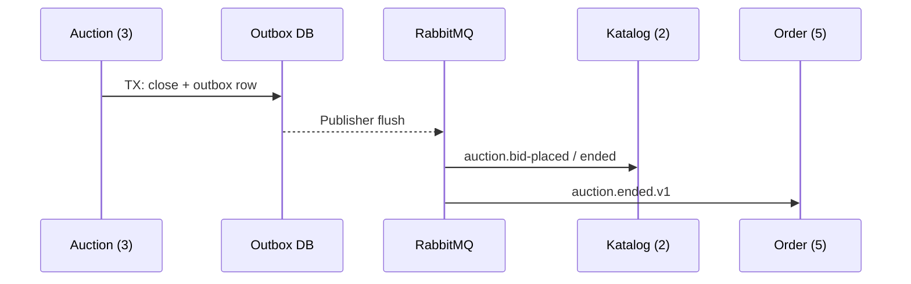

# Desain integrasi — Modul 3 (Outbox lelang)

## Transactional outbox

| Aspek | Sebelum | Sesudah |
|-------|---------|---------|
| Notifikasi peer | HTTP sinkron dari request close | Outbox + worker RabbitMQ |
| Konsistensi | Risiko WON tanpa event | Event dalam transaksi yang sama dengan state auction |
| Retry | Manual | At-least-once + idempotent consumer |

## Pola

- **Transactional Outbox** — `src/service/auction_service.rs`, scheduler outbox
- **Strategy** — `CloseStrategy` / `EnglishReserveClose`

## Bukti

- [7. Profiling Report.md](./7.%20Profiling%20Report.md)
- Platform: [12. Before after perf.md](../../bidmart-infrastructure/docs/12. Before after perf.md)
