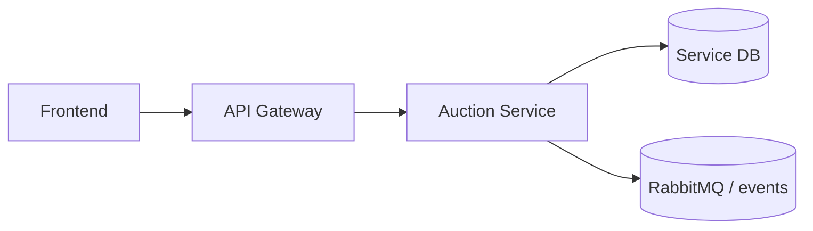

# Software Architecture

## Responsibility

Auction session creation, bid placement, proxy bid, anti-sniping extension, closure jobs, outbox events, settlement, and bid/listing queries.

## Integration Surface

`/api/v1/listings/**`, bid endpoints, proxy bid, close, pending closure compatibility endpoint, event routing keys `auction.*.v1`.

## Platform Position

## State and Consistency

Listings, bids, proxy bids, outbox events, and closure jobs are persisted. Mutex is retained as single-instance serialization optimization; DB transactions/locks remain correctness path.

## Cross-Service Contract

The gateway and event bus are the only supported cross-service entry points. Downstream consumers must tolerate additive optional fields, while existing required fields and routing keys remain stable.

## Production Readiness Decisions

- Database-Backed Concurrency Control: bid and closure mutation paths use database transactions and row locks; the local per-auction `Mutex` is only a single-instance optimization.
- Equal Bid Fairness: bid ordering remains deterministic by amount, timestamp, and persisted bid identity.
- Gateway REST + Internal gRPC: gateway-facing REST contracts stay stable while internal wallet/catalogue calls can use gRPC adapters.
- RabbitMQ Outbox Relay: event publication is isolated behind the outbox relay with retry and backlog visibility.
- Idempotency: closure settlement, wallet hold conversion/release, and event publication use stable correlation identifiers.
- Production Migration Strategy: multi-instance migration keeps database locks and removes reliance on local-only serialization.
- Load Testing: profiling and load evidence remain tracked under `docs/evidence`.
- Domain Reconstruction: repository records are reconstructed into domain objects before lifecycle decisions.
- Auction Type Strategy: English auction is active; future recognized types remain disabled until their workflow is implemented.
